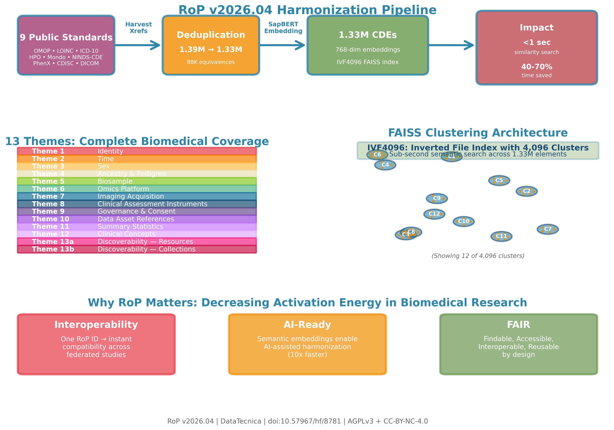

# RoP — Biomedical Reference of Parameters

> *One CDE set to rule them all...*

[](https://creativecommons.org/licenses/by-nc/4.0/)
[](https://www.gnu.org/licenses/agpl-3.0)
[](https://doi.org/10.57967/hf/8781)

**📋 Interested in help using RoP?** → **[Submit Interest Form](https://docs.google.com/forms/d/e/1FAIpQLSfo9btfS1FxrptzAXWAMUT9bfkEJUEL0Swmg3jkEBIncGbI4A/viewform)** ← Start here

---

## Executive Summary

**RoP decreases activation energy in biomedical research by accelerating progress past the biggest bottlenecks ... data wrangling, interoperability and AI-readiness.**

Right now, multi-cohort studies spend months (often years) manually mapping variables—PPMI calls it "MoCA Total Score," NACC calls it `MOCATOTS`, ADNI calls it `MOCA`. Same assessment, zero automatic compatibility. Multiply this by 500 variables across 10 cohorts, and you're looking at **person-years of manual mapping** before analysis even starts.

**RoP provides 1.33 million pre-harmonized Common Data Elements (CDEs)** organized into **13 themes** covering every layer of biomedical data—from individual identity and clinical phenotypes to genomics, imaging, governance, and resource catalogs. Built on OMOP, LOINC, ICD-10, HPO, Mondo, and 9 other major vocabularies. Tag your variable with a RoP ID once—instant compatibility with 200+ studies.

**This isn't aspirational. It's running in production** across hundreds of thousands of samples and multiple millions of data points for collaborators leading massive federated open science initiatives.

**The work behind RoP:** Weeks of planning, one weekend of compute, decades of experience dealing with biomedical data harmonization challenges. The v2026.04 release represents 6+ person-years of expert harmonization work, distilled into a 7.8 GB download.

**What makes this different:**
- **Living collection** — quarterly releases with new vocabularies, collections, and improvements (not static PDFs)
- **AI-powered** — semantic embeddings enable instant CDE matching in The Forge platform (<10 minutes vs 6 months manual)
- **FAIR by design** — Findable (DOI-versioned), Accessible (open download), Interoperable (cross-vocab mappings), Reusable (full build reproducibility)
- **Community-governed** — human-in-the-loop validation ensures quality at scale

**Technical depth:** 1.39 million common data model components harmonized into 1.33 million interoperable data elements, mapped to biomedical language model embeddings representing over 4,000 semantic clusters. Likely all the data points you'll ever need for interoperability and AI-readiness in biomedical research, with a particular focus on neurodegeneration.



---

## What Makes RoP Different

**Most CDE projects are static PDFs.** A committee meets, agrees on definitions, publishes a table, and hopes the field adopts it. Updates take years. Interoperability is aspirational.

**RoP is an AI-powered, FAIR-compliant, governed data infrastructure.** Not another CDE table — a **living semantic ecosystem** that:

### 🔗 **Integrates 1.33 Million CDEs Across 9 Standards**

RoP unifies definitions from every major biomedical vocabulary — **OMOP, LOINC, ICD-10, RxNorm, HPO, Mondo, NINDS-CDE, PhenX, CDISC, DICOM, BIDS, DUO** — into a single harmonized reference. No more choosing between standards: RoP preserves cross-vocabulary mappings as first-class data.

**Example:** Looking for "Parkinson's disease"? RoP connects:
- ICD-10-CM: `G20` (Parkinson's disease)
- OMOP: `378419` (Primary parkinsonism)
- HPO: `HP:0001300` (Parkinsonism)
- Mondo: `MONDO:0005180` (Parkinson disease)
- NINDS-CDE: `ParkinsonsDisease_DiagnosticStatus`

One variable tag in RoP gets you interoperability with all five vocabularies.

### 🤖 **AI-Powered Semantic Matching**

RoP ships with **SapBERT embeddings** for all 1.33M CDEs — biomedical language model vectors trained on PubMed abstracts. The Forge uses these embeddings to:

1. **Auto-suggest matches:** Upload "MoCA Total Score" → Forge instantly finds `MoCA_TotalScore` and 47 equivalent CDEs across NACC, NINDS-CDE, and PhenX
2. **Catch errors:** Flag likely unit mismatches, implausible value ranges, consent code violations
3. **Learn from curation:** Human-in-the-loop corrections improve the model for everyone

**No manual crosswalks. No months of expert panels. Just upload your data dictionary and let AI + human review handle the rest.**

### 🛡️ **Governed at Ingest Time via The Forge**

RoP integrates with [**DataTecnica's The Forge**](https://datatecnica.com/) — a governance platform that **enforces** RoP conformance when data enters your system (not "after the paper is published").

**Forge workflow:**
1. Data team uploads cohort file
2. Forge matches variables to RoP IDs using semantic embeddings
3. Curator reviews AI suggestions, approves/corrects mappings
4. Forge validates: consent codes (DUO), value ranges, required fields
5. Non-compliant data gets **blocked at ingest** with specific error messages
6. Approved data flows into your analysis pipeline, **pre-harmonized**

**This is what "governance" actually means:** Automated quality checks + human oversight + enforced standards.

### 📊 **FAIR by Design**

RoP bundles are **Findable, Accessible, Interoperable, Reusable** out of the box:

- **F**indable: DOI-versioned releases on Zenodo + Hugging Face
- **A**ccessible: Open download (CC-BY-NC-4.0), no paywalls, no restricted vocabularies
- **I**nteroperable: Parquet format, FAISS index, semantic embeddings, cross-vocab xrefs
- **R**eusable: AGPLv3 code, full build scripts, SHA256 checksums, reproducible pipelines

**FAIR isn't a checklist — it's the architecture.** Every RoP release includes machine-readable provenance (`manifest.json`), cryptographic integrity checks, and full build reproducibility scripts.

### 🔄 **Continuously Growing, Versioned Quarterly**

**Traditional CDEs:** Committee publishes v1.0 in 2020 → Errata in 2022 → Maybe v2.0 in 2025

**RoP:** Quarterly releases (v2026.04, v2026.07, v2026.10, v2027.01, ...) with:
- New vocabularies (e.g., SNOMED-free alternatives, emerging ontologies)
- New collections (GP2, CARD, Answer ALS → your project next)
- Improved embeddings (BioLORD-2023, domain-tuned models)
- Bug fixes, schema migrations, governance updates

**Pin the version in your methods section** (`RoP v2026.04`) for reproducibility. Upgrade when you're ready.

### 🧬 **Multi-Modal & Multi-Scale**

RoP covers **every layer of biomedical data** in 13 themes:

| What | Examples | RoP Theme |
|------|----------|-----------|
| **Clinical phenotypes** | Diagnoses, symptoms, drugs, lab tests | 12 (Clinical Concepts) |
| **Genomics** | Assay types, platforms, pipelines, variants | 6 (Omics) |
| **Imaging** | DICOM tags, BIDS metadata, scanner parameters | 7 (Imaging) |
| **Biosample** | Tissue types, cell lines, anatomical sites | 5 (Biosample) |
| **Assessments** | MoCA, UPDRS, MMSE, CDR instruments | 8 (Clinical Instruments) |
| **Governance** | Consent codes, data use, sharing controls | 9 (Governance) |
| **Meta-analysis** | GWAS summary stats, PCA loadings | 11 (Summary Statistics) |
| **Discoverability** | Study catalogs, resource metadata | 13a (Resources) |

**Cross-modal integration is built-in:** Link imaging scans (Theme 7) → genomic assays (Theme 6) → clinical diagnoses (Theme 12) → biosample provenance (Theme 5) using common individual IDs (Theme 1).

**Beyond biomedicine:** The harmonization pattern (AI-assisted HitL + federated governance + versioned schemas) transfers cleanly to other verticals. Applications underway with collaborators in **stock trading** (social data + market integration) and **motorsports** (safety, performance, marketing integration).

---

## The Problem RoP Solves

**You spend 6 months harmonizing data that should have been compatible from day one.**

Every biomedical consortium faces this:
- PPMI calls it "MoCA Total Score"
- NACC calls it `MOCATOTS`
- ADNI calls it `MOCA`
- Your site calls it `moca_total`

Same assessment, four different variable names, no automatic way to merge them. Multiply this by 500 variables across 10 cohorts, and you're looking at **person-years of manual mapping** before analysis even starts.

**RoP fixes this:** Tag your `moca_total` with RoP ID `MoCA_TotalScore` once. Instant compatibility with PPMI, NACC, ADNI, and 200+ other studies using the same RoP tag.

---

## Who Made This & Why

**Primary Authors:** Pietro Marini, Alan Long, Hirotaka Iwaki, Mike Nalls, Dan Vitale

**Organization:** [DataTecnica](https://datatecnica.com)

**Collaborators:** Mette Peters, Hampton Leonard, Andy Henrie, Amara Alexander, Elise Marsan, Yang Fann, Mark Cookson, Cornelis Blauwendraat, Andy Singleton, Huw Morris, Tim Hohman, Sara Biber, John Crary, Syed Shah, Brittany Dugger, David Gutman, Chris Morris, Pat Brannelly, Liesel Jones, Mat Koretsky, Cole Tindall, Mukta Phatak, Zane Jaunmuktane, Mimi Tambi, Brandon Jernigan, Terri Thompson, Mike Karlovich, Kurt Farrell, and many more... **CDEs are a community effort.**

**The "Why":**

We want to accelerate the biomedical research community. Let's make research as FAIR as possible.

We built RoP to solve this for ourselves. We're releasing it **open source for non-commercial use (AGPLv3 + CC-BY-NC-4.0)** because the biomedical community needs a shared CDE reference that:

1. **Works today** (not after the next committee meeting)
2. **Enforces adoption** (via Forge validation at ingest)
3. **Grows continuously** (quarterly releases, not 5-year cycles)
4. **Distributes freely** (no SNOMED/MedDRA/CPT fees)
5. **Leverages AI** (semantic embeddings, not keyword search)
6. **Implements FAIR** (as infrastructure, not aspiration)

---

## Quick Start

### I'm a Biomedical Researcher (Not a Programmer)

**You don't need to code to use RoP.** Here's how to get started:

1. **[Submit Interest Form](https://docs.google.com/forms/d/e/1FAIpQLSfo9btfS1FxrptzAXWAMUT9bfkEJUEL0Swmg3jkEBIncGbI4A/viewform)** --> Let's figure out how we can help you with your project(s)
2. **We'll help you map your data dictionary to RoP CDEs** using The Forge platform (AI-assisted, human-validated)
3. **Your harmonization happens in <10 minutes** (vs 6 months manual crosswalk)

**Found an error or need a new CDE?** Use the **[Schema Feedback Form](https://docs.google.com/forms/d/1AMvVxiTCRVtiqchtzG3hzMo0p2ix81muvJIYdcV4axw/edit?usp=sharing_eip&ts=69fe1129)** to report corrections or suggest additions.

**No downloads, no command line, no setup required.** The Forge handles everything.

**Example workflow:**
- Upload your data dictionary (Excel/CSV)
- AI suggests matches: "Your `moca_total` → RoP's `MoCA_TotalScore` (98% confidence)"
- Expert reviews AI suggestions (10 minutes)
- Download harmonized mapping → apply to your cohort
- Done. Now interoperable with 200+ studies.

---

### I'm a Data Scientist or Developer

### Download Pre-built Bundle (Recommended)

**Hugging Face (fastest, CDN-backed):**
```bash
pip install huggingface_hub
python3 -c "
from huggingface_hub import hf_hub_download
for f in ['elements.parquet', 'embeddings.npy', 'embeddings.faiss', 'manifest.json']:
    hf_hub_download('DataTecnica/RoP_biomedical', f'v2026.04/{f}', cache_dir='./rop_bundle')
"
```

**Zenodo (DOI-versioned, archival):**
```bash
wget https://huggingface.co/datasets/DataTecnica/RoP_biomedical/resolve/main/v2026.04/
tar -xzf rop_v2026.04.tar.gz
cd rop_v2026.04
```

### Build from Source (Reproducible)

Requires: Python 3.10+, 32 GB RAM, CUDA GPU (optional, speeds up embedding from 30 hours to 6 hours)

```bash
git clone https://github.com/datatecnica/rop_build.git
cd rop_build
python3 -m venv venv && source venv/bin/activate
pip install -e .

# Download 9 public sources (~6 GB)
python3 scripts/sprint1_download_all.py

# Build full bundle
python3 scripts/sprint1_dedup_pass1.py           # Dedup: 2 min
python3 scripts/generate_embeddings_direct.py    # Embed: 6 hrs (GPU) / 30 hrs (CPU)
python3 scripts/build_faiss_index.py             # Index: 25 min
python3 scripts/package_final_bundle.py          # Package with boutique CDEs: 1 min

# Output: dist/rop_v2026.04/ (7.8 GB)
```

---

## What's Inside: The Bundle

```
v2026.04/
├── elements.parquet         1,328,973 CDEs (151 MB)
├── embeddings.npy           SapBERT 768-dim vectors (3.9 GB)
├── embeddings.faiss         IVF4096 similarity index (3.9 GB)
└── manifest.json            SHA256 checksums + metadata
```

**Verify integrity after download:**
```bash
sha256sum -c <(jq -r '.files | to_entries[] | "\(.value.sha256)  \(.key)"' manifest.json)
```

---

## Real-World Use Cases

### 1. **Harmonize Multi-Cohort Studies**
Map your 500 variables to RoP IDs → merge data from PPMI, ADNI, NACC, Answer ALS with zero manual crosswalks.

### 2. **Build a FAIR Data Catalog**
Use Theme 13a (Resources) to tag studies with standardized metadata: sample size, modalities, consent codes, FAIR scores.

### 3. **Enforce Consent & Governance**
Use Theme 9 + Forge to block data uploads that violate DUO consent codes or sharing restrictions — **before** data enters your system.

### 4. **Run Meta-Analyses Faster**
Theme 11 (Summary Stats) harmonizes GWAS covariates across cohorts: no more "which ancestry PCs did they use?" guesswork.

### 5. **Link Multi-Modal Data**
Connect genomics (Theme 6) + imaging (Theme 7) + clinical phenotypes (Theme 12) with common individual IDs (Theme 1).

---

## Integration with The Forge

**RoP + Forge = Governed, AI-Assisted Data Pipelines**

- **RoP** = The reference standard (1.33M harmonized CDEs)
- **[The Forge](https://datatecnica.com/forge)** = The enforcement layer (validates, matches, curates)

**Forge uses RoP to:**
1. Match your variables to RoP IDs using semantic embeddings (AI)
2. Vet matches via human-in-the-loop curation (governance)
3. Validate consent codes, value ranges, required fields (FAIR)
4. Block non-compliant data at ingest (enforcement)
5. Grow RoP with approved project collections (continuous improvement)

**[Submit Interest Form](https://docs.google.com/forms/d/e/1FAIpQLSfo9btfS1FxrptzAXWAMUT9bfkEJUEL0Swmg3jkEBIncGbI4A/viewform) to discuss Forge integration for your project.**

---

## The 13 Themes (224 Anchor CDEs)

| Theme | Coverage | Anchors | Example CDEs |
|-------|----------|---------|--------------|
| **1. Identity** | Individual IDs, aliases, external linkages | 3 | `IndividualID`, `IndividualAliases` |
| **2. Time** | Visit dates, age, years from diagnosis | 7 | `VisitDate`, `AgeAtVisit`, `YearsFromEnrollment` |
| **3. Sex** | Chromosomal, assigned-at-birth, gender identity | 3 | `ChromosomalSex`, `GenderIdentity` |
| **4. Ancestry & Pedigree** | Race/ethnicity, genetic ancestry, family structure | 18 | `RaceOMB`, `GeneticAncestry`, `FamilyID` |
| **5. Biosample** | Sample types, anatomy, cell types | 20 | `BiosampleID`, `TissueType`, `AnatomicalSite` |
| **6. Omics** | Assay methods, platforms, pipelines | 22 | `LOINCComponent`, `SequencingPlatform` |
| **7. Imaging** | DICOM/BIDS metadata, scanner parameters | 14 | `ImagingModality`, `FieldStrength`, `DICOMSeriesUID` |
| **8. Clinical Instruments** | MoCA, UPDRS, MMSE, CDR | 13 | `MoCA_TotalScore`, `UPDRS_PartIII` |
| **9. Governance** | Consent codes, sharing controls | 27 | `DUOConsentCode`, `ReshareAllowed` |
| **10. Data Assets** | File URIs, formats, checksums | 15 | `DataAssetURI`, `FileFormat`, `SHA256Checksum` |
| **11. Summary Stats** | GWAS, PCA, meta-analysis metadata | 27 | `GWAS_PValue`, `PCA_PC1Loading` |
| **12. Clinical Concepts** | Diagnoses, drugs, labs, procedures | 13 | `ClinicalConceptCode` (OMOP backbone) |
| **13a. Resources** | Study catalogs, repository metadata | 26 | `StudySampleSize`, `ResourceFAIRScore` |
| **13b. Collections** | Project-specific CDE bundles | 16 | `CollectionID`, `MemberCDECount` |

**Total: 1,328,973 elements in v2026.04** (224 anchors + 1.33M harmonized CDEs from 9 sources + 9 boutique collections)

---

## Vocabulary Inclusion Policy: Open Distribution Only

RoP includes **only vocabularies that allow free redistribution** (CC-BY, CC0, Apache-2.0, public domain).

**✅ Included (open):**
LOINC, HPO, Mondo, DUO, ICD-10/11, RxNorm, ATC, MeSH, UCUM, CDISC, NINDS-CDE, PhenX, BIDS, DICOM, ClinVar, HGNC, NCIt, OncoTree, HemOnc, NAACCR, CVX, NDFRT, and 40+ more via OMOP/Athena.

**❌ Excluded (commercial licenses):**
SNOMED CT, MedDRA, CPT4, UMLS CUIs — these require vendor fees for redistribution. RoP can cross-reference their IDs when upstream sources (NINDS-CDE, OMOP) provide mappings, but no commercial vocabulary *content* ships in RoP bundles.

This prioritizes **redistributability** over **maximal coverage**. Users with SNOMED/MedDRA licenses can layer them onto RoP in their own deployments.

---

## Documentation

| Resource | Description |
|----------|-------------|
| [`docs/SPEC.md`](docs/SPEC.md) | Full interoperability contract specification |
| [`docs/ANCHORS.md`](docs/ANCHORS.md) | 224 anchor CDE reference with rationale |
| [`docs/GOVERNANCE.md`](docs/GOVERNANCE.md) | Forge governance model + contribution workflow |
| [`docs/DISTRIBUTION.md`](docs/DISTRIBUTION.md) | GitHub + Hugging Face + Zenodo strategy |
| [`docs/ROADMAP.md`](docs/ROADMAP.md) | Quarterly release schedule, planned features |

---

## Citation

```bibtex
@dataset{rop_v202604,
  author       = {Marini, Pietro and
                  Long, Alan and
                  Iwaki, Hirotaka and
                  Nalls, Michael A. and
                  Vitale, Dan},
  title        = {RoP v2026.04 - Biomedical Reference of Parameters},
  year         = {2026},
  publisher    = {Hugging Face},
  doi          = {10.57967/hf/8781},
  url          = {https://huggingface.co/datasets/DataTecnica/RoP_biomedical}
}
```

---

## License

- **Data** (CDEs, embeddings): **CC-BY-NC-4.0** — Free for non-commercial use with attribution
- **Code** (Python, scripts): **AGPLv3** — Open source, copyleft, non-commercial

**Commercial Use:** Requires separate licensing. Contact **info@datatecnica.com** for commercial terms.

**Attribution:**
> This work uses RoP (Biomedical Reference of Parameters) v2026.04,
> © 2026 Dan Vitale, Pietro Marini, Michael A. Nalls (DataTecnica),
> licensed under CC-BY-NC-4.0 (data) + AGPLv3 (code).
> https://doi.org/10.57967/hf/8781

---

## Community & Support

- **📋 Interest Form:** [Start here](https://docs.google.com/forms/d/e/1FAIpQLSfo9btfS1FxrptzAXWAMUT9bfkEJUEL0Swmg3jkEBIncGbI4A/viewform) (Forge integration, questions, use cases)
- **✏️ Schema Feedback:** [Corrections & Additions Form](https://docs.google.com/forms/d/1AMvVxiTCRVtiqchtzG3hzMo0p2ix81muvJIYdcV4axw/edit?usp=sharing_eip&ts=69fe1129) (report issues, suggest new CDEs)
- **🐛 Bug Reports:** [GitHub Issues](https://github.com/datatecnica/RoP_biomedical/issues)
- **📧 Email:** info@datatecnica.com

**Governance:** All proposals (new anchors, sources, vocabularies) reviewed via Forge's human-in-the-loop workflow. See [`docs/GOVERNANCE.md`](docs/GOVERNANCE.md).

---

## Acknowledgments

RoP builds on work from:
- **NIH CARD** (Center for Alzheimer's and Related Dementias)
- **GP2** (Global Parkinson's Genetics Program)
- **NACC** (National Alzheimer's Coordinating Center)
- **Answer ALS**, **SEA-AD**, **ADSP-PHC**, **ASAP**, **BDR**, **BDSA**, **PART** through their connection with the Path-ND Consortium by the 10,000 Brains Project

Upstream standards: OHDSI (OMOP), Regenstrief (LOINC), Monarch Initiative (HPO, Mondo), NIH (NINDS-CDE, PhenX), CDISC, GA4GH (DUO), DICOM, BIDS.

---

Foundational concepts for this work are based on this preprint (Long et al 2024, https://pubmed.ncbi.nlm.nih.gov/39484274/) hopefully in press very soon.

---

**Built with 🔨 by DataTecnica | [datatecnica.com](https://datatecnica.com)**
